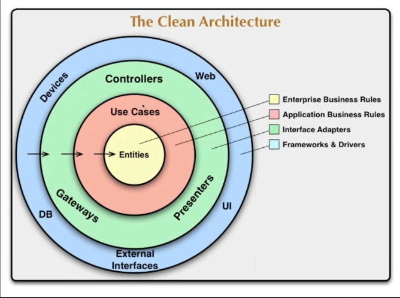
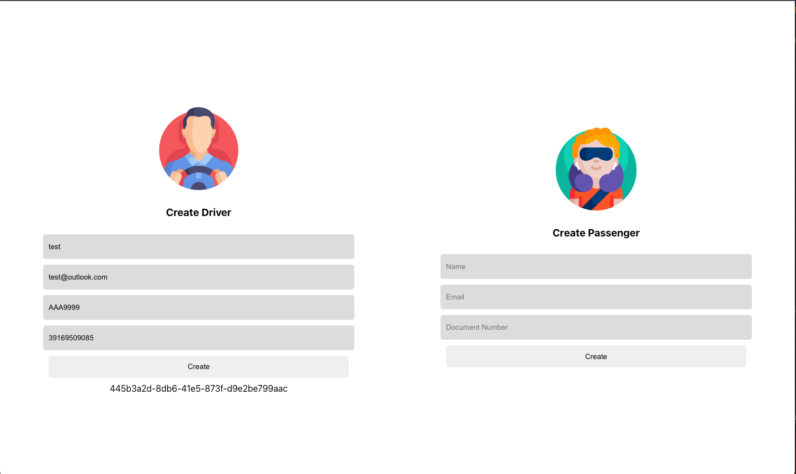

<p align="center">

</p>
<h1 align="center">Clean Code e Clean Architecture - Turma 12</h1>
<p> <i>Projeto prático que será desenvolvido aplicando os conceitos: </i>
Aplicação que representará uma variação do aplicativo <i><b>UBER</b></i>, onde o motorista poderá se cadastrar para fazer corridas para os passageiros.
</br>  
</br>  

### [Aula 01](https://github.com/mariliamessias/branas-clean-code-arch/tree/main/aula_01) - Clean Code and Refactoring
-  Clean Code
-  Code Smells e Técnicas de Refactoring
    * <b>Nomes Ruins:</b>
      * <i>Identificação:</i> nome de variável, método, função, arquivo que não é suficientemente claro.
      * <i>Técnica aplicada para correção:</i> renomeação.
    * <b>Linhas em branco:</b>
      * <i>Técnica aplicada para correção:</i> apagar linhas em branco dentro de métodos e funções.
    * <b>Comentários:</b>
      * <i>Técnica aplicada para correção:</i> introduzir variável explicativa, extrair para métodos e funções para que não haja necessidade de explicação adicional.
   * <b>Código Morto:</b>
      * <i>Técnica aplicada para correção:</i> apagar código não utilizado.
   * <b>Condições confusas e aninhadas:</b>
      * <i>Identificação:</i> condição confusa e que é complexa a interpretação do seu comportamento.
      * <i>Técnica aplicada para correção:</i> extrair condições, introduzir cláusulas de guarda (inverter as condições e interromper o fluxo de execução para eliminar o else). Consolidar condições. Introduzir ternário.
   * <b>Tratamento inadequado de erros ou exceções:</b>
      * <i>Técnica aplicada para correção:</i> tratar adequadamente os erros ou exceções.
   * <b>Números Mágicos:</b>
      * <i>Técnica aplicada para correção:</i> extrair para constantes, extrair para variáveis explicativas.
   * <b>Método Longo</b>
   * <b>Classe Longa</b>
-  Design vs. Arquitetura
-  Projeto: <b>Calcular o preço da corrida</b>
```bash
url: /calculate_ride
method: "post"
input: distance, date
output: price
```

### [Aula 02](https://github.com/mariliamessias/branas-clean-code-arch/tree/main/aula_02) - Test-Driven Development

- Code Smells e Técnicas de Refactoring (Refatoração do algoritmo de validação de CPF);
- Testes além de auxiliarem na consistência do código desenvolvido, auxilia na documentação;
- Estrutura base para a construção de um teste: GIVEN (o que é necessário para executar o comportamento esperado), WHEN (execução) e THEN (verificação após a execução do teste, onde é validada a assertividade do comportamento esperado);
- Testes Unitários: testes de UNIDADE, são mais rápidos e não tem uso de recursos externos;
- Testes de Integração: testes de várias camadas da aplicação, são mais lentos, tem uso de recursos externos;
- Testes E2E: testes de ponta a ponta, são mais lentos e têm mais chance de serem sucetíveis a falhas devido a dependência com a interface com o usuário;
- Projeto: <b>Suporte a criação e consulta de motoristas e passageiros</b>.

```bash
url: /drivers
method: "post"
input: name, email, document, carPlate
output: driverId
```

```bash
url: /drivers/{driverId}
method: "get"
output: id, name, email, document, carPlate, createdAt, updatedAt
```

```bash
url: /passengers
method: "post"
input: name, email, document
output: driverId
```

```bash
url: /passengers/{passengersId}
method: "get"
output: id, name, email, document, createdAt, updatedAt
```

### [Aula 03](https://github.com/mariliamessias/branas-clean-code-arch/tree/main/aula_03) - Ports and Adapters

- <i>A ideia principal do Ports & Adapters é definir a estrutura de uma aplicação para que ela possa ser executada por diferentes tipos de clientes, e possa ser testada isoladamente de dispositivos externos do mundo real do qual a aplicação depende</i> [Ports and Adapters Pattern - jmgarridopaz](https://jmgarridopaz.github.io/content/hexagonalarchitecture.html#tc1);
</br></br>
- Arquitetura Hexagonal: 
  - dentro do hexágono, temos a lógica de negócio, sem relação direta a nenhuma tecnologia, etc;
  - Fora do hexágono existem os atores, que interagem com a aplicação, que podem ser pessoas, outras aplicações, etc;
  - Os atores são arranjados em volta do hexágono dependendo de qual tipo de interação será realizada.
  - Atores do lado esquerdo/superior ao hexágono são chamados de Drivers ou Primary Actors. A interação é feita a partir do ator, que interage com a aplicação.
  - Atores do lado direito/inferior ao hexágono são chamdos de Driven Actors ou Second Actors, onde a interação com eles é feita a partir da aplicação. Esses atores são responsáveis por prover alguma funcionalidade que a aplicação necessite para a implementação de lógica de negócio.
  


- Transaction Stript: organiza a lógica de negócio em procedures (métodos/funções). Assim criando um fluxo de execução. Ex.: classe de serviço chamando outra classe de serviço, que chama uma classe utilitária, etc; 
- Domain Model: modelo onde o domínio está distribuído entre os objetos, e incorpora comportamentos e dados;

### [Aula 04](https://github.com/mariliamessias/branas-clean-code-arch/tree/main/aula_04) - Clean Architecture - Interface Adapters, Frameworks and Drivers, Usecases e Entities
-  Clean Arch
   - Isolar camadas de negócio, tornar as camadas independentes, favorece na testabilidade;
   


- <b>Entities</b>: são responsáveis por modelar as regras de negócio independentes, aplicadas em qualquer contexto e que podem ser desde um objeto com métodos até mesmo um conjunto de funções;
- <b>UseCases</b>: são responsáveis fazer as orquestrações das regras de negócio (entidades), e ligá-las a gateways externos. 
- <b>Interface Adapters</b>: ponte entre os casos de uso e recursos externos (Controller, Gateway, Repository);
- <b>Frameworks And Drivers</b>: nível mais baixo de abstração, é o componente que realiza a conexão com o banco de dados, requisições HTTP, interage com o sistema de arquivos ou acessa recursos de SO;

Dependency rule: quem está fora conhece quem está dentro, mas quem está dentro não conhece quem está fora.

### [Aula 05](https://github.com/mariliamessias/branas-clean-code-arch/tree/main/aula_05) - Clean Architecture - Design Patterns Chain Of Responsability, State e Template Method, Frontend TDD
-  Clean Arch
- Design Patterns:
  - Chain of Responsability: permite passar uma solicitação ao longo de uma cadeia integrada de manipuladores, onde cada um decide se irá processar a solicitação ou passará ao próximo;
  - State: permite que um objeto altere seu comportamento quando seu estado interno é modificado. O exemplo utilizado em aula, foi a mudança de status de uma corrida.
  - Template Method: estrutura de uma superclasse onde é definida a estrutura base do algoritmo de forma abstrata, onde as classes concretas fazem a implementação.
- Desenvolvimento do frontend:

